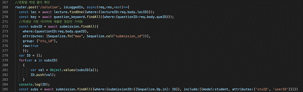

2019-2 연세대학교 데이터베이스

# **데이터베이스 프로젝트 과제**

연세대학교 구도연, 송재용, 이용훈

 

프로젝트에 대한 빠른 이해를 돕기 위해 작동에 대한 영상을 제작하였습니다. 영상을 시청하시면 아래의 내용들을 빠르게 파악하실 수 있습니다. 

영상 링크: [**https://youtu.be/ge-VtGnKxFE**](https://youtu.be/ge-VtGnKxFE)

 

본 프로젝트는 nodejs LTS, expressjs, bootstrap, js, multer, xlsx, Handlebars를 이용하였습니다.

 

**A. 테이블 구조 및 attribute**

 

 

***사용자/강사/학생\***

 

**1. users [users.js]**

전체 사용자 테이블입니다. 강사, 학생은 모두 user테이블에 강사인지 학생인지 구분하는 type속성과 함께 user테이블에 저장됩니다.

●    속성 : user_id, email_id, name, type(1:강사, 0:학생), password

●    Primary Key : user_id

 

**2. teachers [teachers.js]**

강사 테이블입니다. 강사들은 가입과 동시에 teacher 테이블에 저장되며, tchI_id를 부여받습니다. 

●    속성 : tch_id, user_id

●    Primary Key : tch_id

●    Foreign Key : user_id REFERENCES users

 

**3. students [students.js]**

학생 테이블입니다. 학생들은 가입과 동시에 student 테이블에 저장되며, stu_id를 부여받습니다.

●    속성 : stu_id, user_id

●    Primary Key : stu_id

●    Foreign Key : user_id REFERENCES user

 

<추가 설명>

학생과 강사의 관계를 명확하게 표현하기 위해 users이외에 students, teachers 테이블을 만들어 사용하였습니다. 과목은 처음 만든 저작자를 가지기 때문에 teachers와 subjects는 1:N관계를, 학생은 여러 과목에 접근할 수 있어 students와 subjects는 M:N관계를 가집니다. 이에 따라 subjects에 대표 강사 ID인 tch_id가 subjects에 foreign key로 포함되었고, student_subject 테이블을 별도로 생성하였습니다.

 

 

***과목/강의/문항\***

 

**4. subjects [subjects.js]**

과목 테이블입니다. 과목 이름, 과목 정원, 담당 강사 ID가 함께 저장됩니다.

teacher, student 테이블과 직접 연결되어 있어, user_subject 테이블은 별도로 생성하지 않았습니다.

●    속성 : subject_id, name, limit, tch_id

●    Primary Key : subject_id

●    Foreign Key : tch _id REFERENCES teachers

 

**5. lectures [lectures.js]**

[Sequelize 테이블명 lecture] 강의 테이블입니다. 강의가 생성되면 강의 ID를 부여받습니다. 소속 과목 ID, 강의 이름, 시작 시간, 종료 시간, 담당 강사 ID가 저장됩니다.

●    속성 : lecture_id, subject_id, name, startDate, endDate, tch_id

●    Primary Key : lecture_id

●    Foreign Key : tch_id REFERENCES teacher, subject_id REFERENCES subject

 

**6. lecture_keywords [lecture_keywords.js]**

강의 키워드 테이블입니다. 강의 키워드가 생성되면, 키워드 ID를 부여받습니다. 

●    속성 : keyword_id, lecture_id, lecture_keyword, importance

●    Primary Key : keyword_id

 

**7. questions [questions.js]**

문항 테이블입니다. 문항이 생성되면 문항 ID가 부여되며, 유저 ID, 소속 강의 ID, 문항 유형, 타이틀, 문제, 답, 난이도, 실질난이도, 시간 제한, 보기가 저장됩니다.

●    속성 : question_id, user_id, lecture_id, type(0:단답형, 1:객관식, 2:파라미터), title, question, answer, difficulty, realDifficulty, timeLimit, bogi1, bogi2, bogi3, bogi4, bogi5

●    Primary Key : question_id

●    Foreign Key : lecture_id REFERENCES lecture, user_id REFERENCES user

 

**8. question_keywords.js**

[Sequelize 테이블명 question_keyword] 문항 키워드 테이블입니다. 문항 ID, 키워드, 소속 강의 ID, 키워드 배점이 저장됩니다.

●    속성 : question_id, question_keyword, lecture_id, score

 

<추가 설명>

강의와 강의 키워드, 문항 키워드는 조건으로 주어진 테이블과 명칭만 다를 뿐 구조는 동일합니다. 문항 키워드의 경우 문항을 만들 때 강의 키워드에서 강사가 선택할 수 있도록 하였습니다. 강의 키워드, 문항과 문항 키워드는 M:N관계를 가져 관계 테이블을 별도로 두었습니다.

 

문항 테이블의 경우 문항을 만든 유저마다 접근할 수 있는 문항이 다르기 때문에 users와 questions의 1:N 관계가 성립됩니다. 따라서 문항에 user_id가 foreign key로 추가되었습니다. 문항 제목 title, 문제 question, 정답 answer, 그리고 5개의 보기를 속성으로 가집니다. 정답은 객관식의 경우 1,2,3,4,5과 같이 숫자와 콤마가 조합된 varchar로 저장되며, 주관식은 주관식 답 그대로 저장됩니다. 보기는 객관식인 경우에만 값을 가지고 단답형은 null로 저장됩니다. 또한 주어진 테이블과 동일하게 난이도 difficulty와 실질 난이도 real_difficulty, 시간 제한 time_limit을 속성으로 가집니다. 문제 유형 type은 0인 경우 단답형, 1인 경우 객관식, 그리고 2인 경우 파라미터를 가지는 단답형 문항입니다. 

 

 

***파라미터/학생 풀이 답\***

 

**9. parameters [parameters.js]**

파라미터 테이블입니다. 파라미터가 생성되면 파라미터 ID를 부여받습니다.

●    속성 : parameter_id, question_id, answer, p1, p2, p3, p4, p5

●    Primary Key : parameter_id

●    Foreign Key : question_id REFERENCES question

 

<추가 설명>

파라미터를 가지는 단답형 문항을 위해 parameter 테이블이 추가되었습니다. 해당되는 문항의 question_id 파라미터별 정답 answer, 그리고 각 파라미터 p1 ~ p5를 포함하고 있습니다. 

 

 

**10. submissions [submissions.js]**

학생 풀이 답 테이블입니다. 학생들이 문제를 풀고난 후 문항 ID, 학생 ID와 함께 정답이 sub_answer에 저장됩니다. 정답에 따라 점수도 함께 계산되어 저장됩니다.

●    속성 : submission_id, question_id, stu_id, score, sub_answers, parameter_id

●    Primary Key : submission_id

●    Foreign Key : question_id REFERENCES questions, stu_id REFERENCED students

 

<추가 설명>

학생들이 제출한 답은 submissions테이블에 저장됩니다. 학생 아이디 stu_id와 문항 아이디 question_id를 foreign key로 가집니다. 제출한 답은 sub_answer에 저장되고, 정답에 따라 score에 학생이 받은 점수가 저장됩니다. 파라미터형 단답형을 푼 경우 parameter_id가 저장됩니다. 

 

 

***문제 은행\***

 

**11. bank_question_keywords [bank_question_keywords.js]**

문제 은행 키워드 테이블입니다. 문제 은행 ID, 문제 은행 키워드, 강의 ID, 배점이 저장됩니다.

●    속성 : bankQuestion_id, bank_question_keyword, lecture_id, score

●    Foreign Key : bankQuestion_id REFERENCES bank_question

 

**12. bank_questions [bank_questions.js]**

문제 은행 테이블입니다. 문제 은행이 생성되면, 문제 은행 ID가 부여됩니다. 담당 강사 ID, 강의 ID, 문항 유형, 타이틀, 문제, 답, 난이도, 실질난이도, 시간 제한, 보기가 저장됩니다. 

●    속성 : bankQuestion_id, tch_id, lecture_id, type, title, question, answer, difficulty, realDifficulty, timeLimit, bogi1, bogi2, bogi3, bogi4, bogi5

●    Primary Key : bankQuestion_id

●    Foreign Key : tch_id REFERENCES teacher

 

**13. bank_parameters [bank_parameters.js]**

문제 은행 파라미터 테이블입니다. 문제 은행 파라미터가 생성되면, 문제 은행 파라미터 ID가 생성됩니다. 문제 은행 ID, 답, 파라미터 번호가 저장됩니다.

●    속성 : bankParameter_id, bankQuestion_id, answer, p1, p2, p3, p4, p5

●    Primary Key : bankParameter_id

●    Foreign Key : bankQuestion_id REFERENCES bank_question

 

<추가 설명>

문항을 문제 은행에 넣은 경우 문항 questions테이블, 문항 키워드 question_keywords테이블, parameters테이블이 복제되어 각각 bank_questions, bank_question_keywords, bank_parameters로 저장됩니다.

 

모든 테이블에는 createdAt, updatedAt이 추가로 포함되었습니다. 

 

 

**B. 사용한 SQL문**

 

mySQL, Sequelize 이용해 DB를 구성하였습니다.

 

**1. 테이블 및 attribute 생성, table 간의 관계 형성(foreign key 설정)**

 

teachers.js를 예시로 사용한 Sequelize 구문을 설명하겠습니다. 다른 테이블 생성을 위해 사용한 코드는 models 폴더에 포함되어있습니다.

 

<teacher 테이블을 생성하는 /models/teachers.js>

 

●    **테이블 생성**

sequelize.define을 통해 teachers 테이블을 선언합니다. 코드 내에서는 teacher라는 이름으로 사용됩니다.

 

●    **attribute 생성**

teachers 테이블 안의 tch_id 속성을 정의합니다. 코드 내에서는 tchID라는 이름으로 모델의 속성을 불러옵니다. 데이터형은 Integer, primary key이기 때문에 null을 허용하지 않았습니다. 강사가 추가되면 자동으로 ID가 지정됩니다.

 

user_id 속성을 userID라는 이름으로 정의하였습니다. 1:1관계에서 teachers 모델이 user_id를 foreign key로 가지는 것을 belongsTo로 정의하였습니다. 반대로 user 테이블에서는 hasOne을 이용해 teacher 테이블에서 foreign key를 가진다는 것을 명시해주었습니다.

<users테이블의 관계 정의 /models/users.js>

 

●    **테이블 간 1:N 관계 형성** 

teachers 테이블은 bank_question 테이블과 1:N 관계를 가집니다. 이를 hasMany를 통해 정의하였습니다. 

 

●    **테이블 간 M:N 관계 형성** 

여러 강사가 같은 과목에 접근할 수 있는 경우를 대비해 teachers 테이블과 subjects 테이블의 M:N 관계를 정의해 두었습니다. 이 경우 belongsToMany 를 통해 관계를 설정하였습니다.

 

 

**2. onDelete 관계 설정**

 

onDelete의 경우 subjects 테이블 예시를 통해 설명하겠습니다. 

****

****

<subjects 테이블을 생성하는 /models/subjects.js>

****

과목을 삭제하는 경우 그 안에 포함된 강의도 함께 삭제되어야 합니다. 따라서 subjects 테이블과 lectures 테이블간의 관계에 onDelete: ‘cascade’를 정의하여 과목이 삭제되는 경우 함께 삭제되도록 하였습니다. 

 

****

<과목을 삭제하는 post 라우팅. /routes/subjects.js>

 

과목을 삭제할 때 안에 포함된 강의 키워드, 강의, 문항 키워드, 문항이 함께 삭제될 수 있도록 삭제 post 라우팅이서 destroy를 사용하여 삭제할 수 있도록 하였습니다. 수강 학생과 과목 관계를 나타내는 student_subject 테이블의 경우 Sequelize에서 자동으로 생성되었으므로, subjects 테이블을 삭제하면 자동으로 함께 삭제됩니다. 

 

 

**C. 3가지 프로젝트 목표 기능에 대한 스크린샷과 구현 방법**

 

**1. LMS 시스템의 ‘학생별 개별 문항 제공' 기능 개발**

 

**[문항 만들기 페이지]**

/views/question_make.ejs, /routes/questions.js

 

●    객관식, 단답형, 또는 파라미터를 삽입할 수 있는 단답형 문제를 만들 수 있습니다. 

●    동일한 문항에 대해 n개의 파라미터 set을 엑셀 파일에 수동 입력 후 업로드할 수 있습니다. 파라미터는 최대 5개까지 사용가능하며, {params}를 사용해 각 파라미터가 보여질 위치를 지정할 수 있습니다. 파라미터 ID는 업로드 시 자동 지정됩니다. 

●    시험에 제공될 때는 js 라이브러리 ‘Handlebars’를 이용해 그 때 맞는 파라미터를 제공합니다.

 

<test.xlsx 예시>

 

***파라미터가 있는 문항 업로드\***

 

●    expressjs에서 파일 업로드에 많이 쓰이는 ‘multer’모듈과 xls파일 파싱에 많이 쓰이는 ‘xlsx’ 모듈을 이용하였습니다. 

●    일반적인 문항 생성은 프로젝트의 기본 요구사항이며, 코드 또한 단순하기 때문에 파라미터가 있는 문항 생성 관련하여 집중적으로 설명하였습니다.

●    우선 문항 생성은 다른 일반 문항 생성과 동일합니다만, 정답은 파라미터에 따라 존재하기 때문에 원하는 경우에 기본 정답을 입력할 수 있고 그렇지 않은 경우에는 null로 진행할 수 있습니다.

●    문항을 생성하면 이 때 생긴 questionID를 넘겨주어, 이를 키로 하여 파라미터를 생성합니다.

●    위에서 router.post로 라우팅 해오면서 ‘multer’모듈을 활용하여 upload.single(‘params’) 구문을 통해 페이지에서 name=‘params’로 넘겨준 파일을 req.file에 저장하여 줍니다.

●    업로드한 파일은 ‘/uploads’하위에 저장되며, ‘xlsx’ 모듈을 활용하여 이를 파싱합니다.

●    파싱한 뒤에 시퀄라이즈로 파라미터를 DB에 저장합니다.

●    코드 위치: /routes/questions.js

<파라미터가 있는 문항 생성 코드>

<router에서 ‘multer’ 모듈의 활용>

< ‘multer’ 모듈과 ‘xlsx’ 모듈의 설정>

 

**[학생별 개별 문항 제공 페이지]**

예시 위에서 만든 ‘파라미터 예시 문항' 학생 풀이 페이지 

(source: /views/free_test.ejs, /routes/test.js, /public/javascripts/test.js)

 

●    학생마다 랜덤으로 파라미터를 선택하여 제공합니다.

●    {params}로 적혀있던 부분이 엑셀 파일의 값으로 변경되어 문제로 보여집니다.

●    {params}를 파라미터값으로 바꾸는 템플릿 작업은 가장 많이 쓰이는 템플릿 라이브러리인 Handlebars 라이브러리을 이용했습니다.

●    학생이 답안을 제출한 경우 파라미터 별 정답과 비교해 submission에 정답과 점수가 저장됩니다.

 

***문제에 파라미터 보이기\***

 

●    코드 위치: /routes/tests.js (라우팅), /public/javascripts/test.js (js파일)

<문제 푸는 화면 라우팅 /routes/tests.js>

 

●    라우팅을 보면 파라미터 문항의 경우에는 랜덤으로 파라미터를 하나 골라서 사용자에게 보내주도록 하여 학생들에게 개별 문항을 제공할 수 있도록 하였습니다. (Math.random()이용)

 

<{params} 교체 템플릿 작업 /public/javascripts/test.js>

 

●    ‘Handlebars’ 라이브러리를 이용해서 {params}를 라우팅에서 보내준 파라미터로 교체해서 보여줍니다.

 

***파라미터 별 제출된 답 저장\***

 

●    코드 위치: /routes/tests.js

●    일반 문항의 제출된 답 저장은 단순하며 기본 요소이기 때문에, 파라미터 별로 제출된 답 저장하는 것 관련하여 중점적으로 설명하였습니다.

●    파라미터를 쿼리로 불러와서, 정답을 추출하고, 이를 제출된 답과 비교하여 채점을 진행하였습니다. 또한 문제의 키워드를 불러와서 이들의 score를 더해 문항의 점수를 계산하여 채점 결과를 저장하였습니다.

 

<파라미터가 있는 문항의 제출된 답 저장 및 채점 /routes/tests.js>

 

**2. 문제은행에서 여러 개의 문제 set을 추출**

 

**[문제 조건 설정 페이지]**

문제 수, 난이도, 실제 난이도, 키워드, 전체 점수 합을 조건으로 하여 문제 Set을 총 3개 추출하도록 하였습니다.

****

 

***조건을 기반으로 문항 추출하기\***

 

●    코드 위치: /routes/questions.js

●    추출 방식은 mysql의 "order by rand()"와 "limit" 명령어를 결합하고 where 구문에 키워드를 넣어 랜덤 추출하고, 이를 30회 반복하여 가장 적절한 결과를 출력하는 방식입니다.

●    실제 난이도와 난이도까지 구문에 넣어서 진행하지 않은 이유는 세트에 비슷한 난이도의 문제만 나오는 것이 아니라 어려운 문제도 있고 쉬운 문제도 존재하여 이것들의 평균이 원하는 난이도에 부합하여야 편하게 한번에 변별력 있는 문제 출제를 할 수 있기 때문입니다.

●    또한 꼭 맞는 문제 세트가 없더라도 위 구현 방식은 근사치의 세트를 제공하기 때문에 보다 효용성이 높아 이렇게 구현하였습니다.

<조건에 맞는 문항 추출 /routes/questions.js>

 

 

**[문제 세트 제공 페이지]**

문제 수, 난이도, 실제 난이도, 키워드, 전체 점수 합을 조건으로 하여 총 3개의 문제 세트를 추출하고 이를 보여주도록 하였습니다.

****

<세트 제공 화면>

 

●    각 세트마다 얼마나 원하던 조건에 알맞는지 알 수 있도록 난이도, 실제 난이도, 전체 점수 합을 제공하도록 하였습니다.

●    문제의 내용도 확인 할 수 있도록 하여 추출된 문제 세트가 자신의 의도와 맞는지 확인하고 세트를 선택할 수 있도록 하였습니다.

●    만약에 자신의 의도와 맞는 세트가 없는 경우에는 위의 ‘다시 불러오기’ 버튼을 통해서 다시 세트를 가져올 수 있습니다.

 

**3. 문항 채점 결과 로딩 기능**

 

**[강의별 문항 리스트 페이지]**

예시 ‘1차 퀴즈'강의의 문항 리스트  /views/question_list.ejs, /routes/questions.js

●    학생이 문항을 푼 결과를 강사가 확인할 수 있습니다. 

●    강의 내 문항 리스트에서 문항 별로 학생 풀이를 확인하는 페이지로 이동이 가능합니다.

 

 

**[학생풀이 결과 페이지]** 

예시 문항 3번 객관식 ‘데이터베이스’문제 /views/question_solution.ejs, /routes/questions.js

 

***문항 채점 결과 로딩 화면\***

 

●    문항 별로 평균 점수와 실질 난이도, 학생 별 점수를 확인할 수 있습니다. 

●    학생별로 가장 마지막에 제출한 정답만을 보여줍니다. 

○     제출된 정답 테이블인 submission에서, 해당 문항의 정답 제출 중 학생 별로 가장 나중에 제출된 (questionID가 가장 큰) tuple만을 결과로 보여줍니다. submission테이블에 stuID, user테이블에 userID값이 따로 저장되어 있으므로 left outer join하여 subs에 저장하고, 이 결과를 화면에 보여줍니다.

●    파라미터가 있는 문항의 경우, 학생별로 제출된 문항에 연결된 테이블에서 파라미터를 읽어와 정답 확인 화면에 함께 보여줍니다.

</routes/questions.js 267-328>

 

 

***실질 난이도 계산\***

 

●    학생들이 문제의 답을 제출하였을 때 점수를 이용해 문항의 실질 난이도를 계산합니다. 계산된 실질 난이도는 question 테이블의 realDifficulty 속성으로 저장됩니다. 실질 난이도는 10점 만점의 실수값입니다.

●    실질 난이도는 일반적으로 (정답을 맞춘 학생 수/전체 학생수)로 계산되지만, 부분 점수가 있어 정답을 맞춘 학생을 나누기 어려워 (1-(평균점수/전체점수))*10 로 계산하였습니다.

○     학생이 문제 푼 기록이 없는 경우 realDifficulty는 강사가 입력한 난이도와 같은 값으로 저장됩니다. 

○     학생이 새로운 답을 제출한 경우 각 채점된 점수를 받아 평균 점수를 계산하고, 이 평균 점수를 바탕으로 실질 난이도를 계산해 question의 realDifficulty 속성에 업데이트합니다. 

</routes/tests.js 148-189>

 